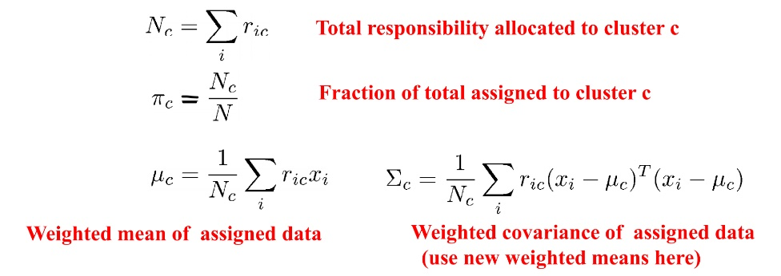

# Clustering Application

A web application for exploring clustering algorithms on student data.



## Features

- Interactive visualization of clustering results
- Multiple clustering algorithms:
  - K-Means
  - Expectation-Maximization (EM)
  - Hierarchical Clustering
- PCA dimensionality reduction for data visualization

## Technologies

- **Backend**: Flask, Python, NumPy, Pandas, scikit-learn
- **Frontend**: HTML, CSS, JavaScript
- **Data Processing**: PCA for dimensionality reduction

## Usage

To run the application:

```
python app.py
```

Then navigate to http://localhost:8080 in your web browser. 