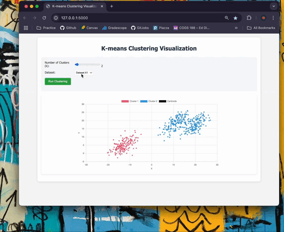
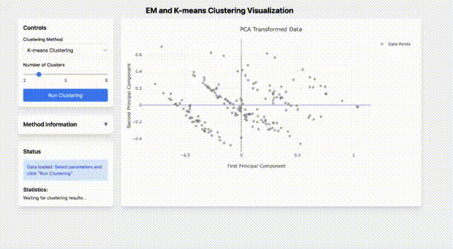

# A1: K-means Clustering Visualization

Interactive web app for visualizing K-means clustering algorithm on different datasets. Originally developed as a class project, I expanded it to include additional features and improvements to be a more comprehensive learning tool.

### Demo GIF

# A2: Clustering Algorithms Comparison

A web application for exploring multiple clustering algorithms (K-means, EM, Hierarchical) on student data with PCA dimensionality reduction.

## Technologies
- Flask, Python, NumPy, Pandas, scikit-learn
- Interactive visualization with HTML, CSS, JavaScript
